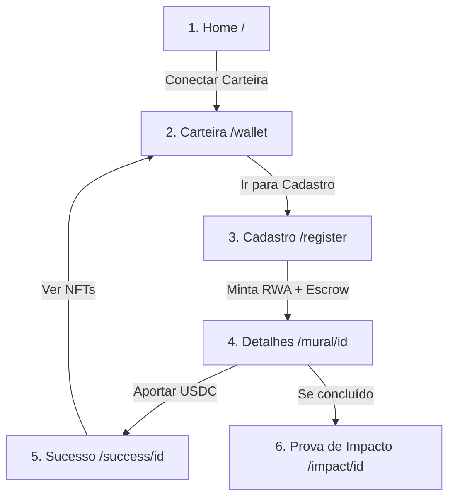

# Roteiro de Demonstração — Muralis dApp

Este guia descreve os passos exatos para realizar uma demonstração perfeita do ecossistema **Muralis** para o Hackanation 2026. Ele integra os fluxos do frontend React com os contratos Solana (`muralis_rwa`, `muralis_escrow`, `muralis_nft`).

---

## 1. Configuração do Ambiente de Demonstração

Para demonstrar as transações reais da Phantom Wallet na Solana, você pode optar pela **Localnet (Validador Local)** ou **Devnet (Testnet da Solana)**.

### Opção A: Localnet (Recomendada - Validador Local 100% Controlado)
Ideal para apresentações rápidas, sem dependência de internet ou limites de taxa do airdrop da Devnet.

#### Passo 1: Iniciar o Validador Local Clonando o Metaplex
O programa da Metaplex é essencial para mintar os NFTs (RWA e Certificados). Execute no terminal (WSL/Ubuntu):
```bash
solana-test-validator --url https://api.devnet.solana.com --clone metaqbxxUerdq28cj1RbAWkYQm3ybzjb6a8bt518x1s --reset
```
*Mantenha este terminal aberto.*

#### Passo 2: Implantar os Contratos no Validador Local
Em outro terminal, acesse a pasta dos contratos e faça o deploy:
```bash
cd muralis_contracts
anchor build
anchor deploy
```

#### Passo 3: Criar um Token USDC Local e Financiar sua Carteira Phantom
Como a carteira Phantom precisará de USDC reais do validador para doar, configure um token local:
1. Pegue a chave pública da sua carteira Phantom conectada (ex: `Dj3...`).
2. Adicione SOL ao Phantom local:
   ```bash
   solana airdrop 10 <SUA_WALLET_PHANTOM>
   ```
3. Crie o token USDC customizado localmente (6 decimais):
   ```bash
   solana-keygen new --outfile local-usdc.json --no-bip39-passphrase --force
   # O comando exibirá uma chave pública (ex: Gx...). Anote-a.
   
   spl-token create-token local-usdc.json --decimals 6
   ```
4. Crie a conta associada (ATA) e minte 10.000 USDC para a sua carteira Phantom:
   ```bash
   spl-token create-account <MINT_USDC_GERADA> --owner <SUA_WALLET_PHANTOM>
   spl-token mint <MINT_USDC_GERADA> 10000 <SUA_WALLET_PHANTOM>
   ```
5. **Atualize o frontend**: Abra o arquivo `muralis_code/src/services/blockchainService.ts` e substitua o endereço da constante `USDC_MINT` (linha 72) pelo endereço do seu `<MINT_USDC_GERADA>`.

---

### Opção B: Devnet (Rede de Testes Pública da Solana)
Ideal para mostrar o projeto no Solana Explorer público.

1. **Configurar o Phantom**: Altere a rede no Phantom para **Devnet** (Configurações do desenvolvedor -> Alterar Rede -> Devnet).
2. **Atualizar o Endpoint**: No arquivo `muralis_code/src/components/SolanaProvider.tsx`, troque `LOCALNET_ENDPOINT` para `https://api.devnet.solana.com`.
3. **Solicitar SOL para a carteira**:
   ```bash
   solana airdrop 2 <SUA_WALLET_PHANTOM> --url https://api.devnet.solana.com
   ```
4. **Solicitar USDC de teste**: Visite o faucet oficial da Circle (faucet.circle.com) e solicite USDC para Solana Devnet inserindo o endereço da sua carteira Phantom.

---

## 2. Dados Recomendados para a Demonstração Perfeita

Use estes dados pré-selecionados para garantir que as métricas de impacto façam sentido e impressionem a banca de jurados:

### Formulário de Cadastro do Mural:
*   **Nome do Artista:** `Luan Silva`
*   **Título do Projeto:** `Sopro da Amazônia #001`
*   **Conceito Artístico:** `Mural ecológico feito com tinta fotocatalítica. A obra retrata a divindade protetora da floresta soprando folhas que se transformam em vento limpo. Simboliza a purificação do ar urbano e a reconexão dos moradores do centro com a natureza.`
*   **Largura (m):** `10`
*   **Altura (m):** `8`
    *   *Área Calculada:* `80.00 m²`
*   **Tinta Fotocatalítica (Litros):** `40`
    *   *CO₂ estimado absorvido:* `1.6 kg/ano`
    *   *Árvores equivalentes:* `1600` 🌳 *(Claim: 1m² = 20 árvores)*
*   **Endereço:** `Av. Paulista, 1500`
*   **Cidade:** `São Paulo`
*   **UF:** `SP`
*   **Orçamento Necessário (USDC):** `50`
*   **Detalhamento do Orçamento:**
    ```text
    - 25 USDC: 40L de Tinta fotocatalítica especial
    - 15 USDC: Ajuda de custo e cachê do artista
    - 10 USDC: Aluguel de andaimes e EPIs
    ```

---

## 3. Passo a Passo do Fluxo de Demonstração (Sequência de Telas)

Abra a aplicação em `http://localhost:5173`. Garanta que a extensão da Phantom Wallet está instalada e desbloqueada.



### Passo 1: Início e Conexão da Carteira (Tela: Wallet)
1. Vá até a aba **Carteira** no menu inferior.
2. Clique no botão de conexão **Connect Wallet** e selecione a **Phantom**.
3. Aprove a conexão na extensão Phantom.
4. **O que mostrar:** O saldo em SOL real e a badge verde indicando a rede conectada. Mostre também a seção vazia de "Meus Certificados de Apoiador" para evidenciar que ainda não há contribuições registradas nesta carteira.

### Passo 2: Cadastro do Projeto (Tela: Register)
1. Clique no botão de criar/cadastrar no topo ou no menu correspondente (`/register`).
2. **Etapa 1 (Dados da Obra):**
   * Preencha com os dados do *Sopro da Amazônia #001* (Luan Silva, 10m x 8m).
   * Destaque o cálculo automático de **Área Total: 80.00 m²**.
3. **Etapa 2 (Impacto):**
   * Coloque a localização (Av. Paulista, 1500, São Paulo, SP) e os `40` Litros de tinta.
   * **Destaque de ESG:** Mostre a estimativa de impacto calculada em tempo real na tela: **1.6 kg CO₂/ano** e **≈ 1600 árvores equivalentes**. Comente sobre a tecnologia de tinta fotocatalítica.
4. **Etapa 3 (Orçamento):**
   * Insira a meta de **50 USDC** e preencha o detalhamento do orçamento.
5. **Transação On-Chain (RWA):**
   * Clique em **Gerar Token RWA**.
   * A Phantom irá abrir para aprovação da transação de mint do RWA (`mintProjectRwa` no programa `muralis_rwa`) e imediata abertura do cofre (`initializeEscrow` no programa `muralis_escrow`).
   * Aprove a assinatura. O sistema processará o envio dos metadados e redirecionará automaticamente.

### Passo 3: Detalhes e Financiamento (Tela: Details)
1. Você será redirecionado para a tela `/mural/<id-gerado>`.
2. **O que mostrar:**
   * O status do mural como `"funding"` (Em captação).
   * O endereço do token RWA real exibido e o link clicável para visualizá-lo no Solana Explorer.
   * Os indicadores de sustentabilidade calculados e gravados na blockchain.
3. **Realizar o Apoio:**
   * Insira o valor de **50 USDC** no campo de contribuição (para bater a meta de uma vez).
   * Clique em **Financiar este Mural com USDC**.
   * **Transação On-Chain (Escrow + NFT):**
     * A Phantom abrirá uma transação para transferir os 50 USDC para o endereço PDA do cofre (`contribute` no programa `muralis_escrow`).
     * Em seguida, ela abrirá a transação para mintar o Certificado de Apoiador (`mintSupporterCertificate` no programa `muralis_nft`).
   * Aprove ambas as transações.

### Passo 4: Confirmação e Sucesso (Tela: Success)
1. Após a aprovação on-chain, o usuário cai na tela `/success/<id-contribuicao>`.
2. **O que mostrar:**
   * A animação de confete e a confirmação visual.
   * O resumo da transação mostrando o ID de assinatura on-chain e o endereço do mint do NFT gerado.
   * A prévia visual do NFT de apoiador gerado dinamicamente para o financiador.
3. Clique em **Ver NFT na minha carteira**.

### Passo 5: Verificação dos Ativos (Tela: Wallet)
1. Você volta para a tela de **Carteira** (`/wallet`).
2. **O que mostrar:**
   * O novo card de "Meus Certificados de Apoiador" listando o NFT do mural recém-financiado.
   * Destaque o saldo e clique no link de endereço do NFT para abrir no Solana Explorer e provar que ele é um token real sob a custódia da carteira Phantom do usuário.

### Passo 6: Prova de Impacto (Tela: Impact)
1. Navegue para a tela de **Impacto** (`/impact`).
2. Selecione o projeto finalizado (ou use o seed `"Mural da Vila"`, já concluído, para demonstrar o visual final do mural com o QR Code).
3. **O que mostrar:**
   * O status de verificação.
   * Os dados totais consolidados de CO₂ capturado e árvores plantadas equivalentes.
   * O QR Code dinâmico da parede física ligando-a a esta página.
   * A listagem on-chain de "Apoiadores Principais" com seus endereços parciais, ilustrando a rastreabilidade pública dos fundos.

### Passo 7: Mapa Interativo (Tela: Map)
1. Abra a tela de **Mapa** (`/map`).
2. **O que mostrar:**
   * Os murais plotados no mapa do Brasil usando o tema Dark.
   * Use os filtros "Em financiamento", "Financiados" e "Concluídos" para mostrar como o ecossistema organiza o pipeline de revitalizações das cidades.
   * Clique nos pins do mapa para abrir os popups customizados com fotos e links para os detalhes de cada mural.

---

## 4. Dicas para Evitar Erros Durante o Pitch

*   **Fundos Iniciais:** Certifique-se de que a carteira Phantom que você usará tem pelo menos 2.0 SOL e 100 USDC antes de subir no palco.
*   **Conexão de Rede:** Se estiver usando o validador local, lembre-se de que o Phantom precisa estar no cluster "localhost" e o validador estar rodando na porta `8899`.
*   **Transição Sem Falhas:** Se o validador local cair por qualquer motivo técnico no palco, basta desconectar a carteira Phantom no app para que o **Mock Mode** assuma imediatamente com latência realista, permitindo que você termine o pitch sem que a audiência note o imprevisto.
